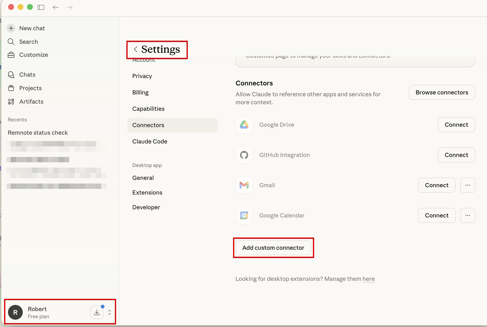
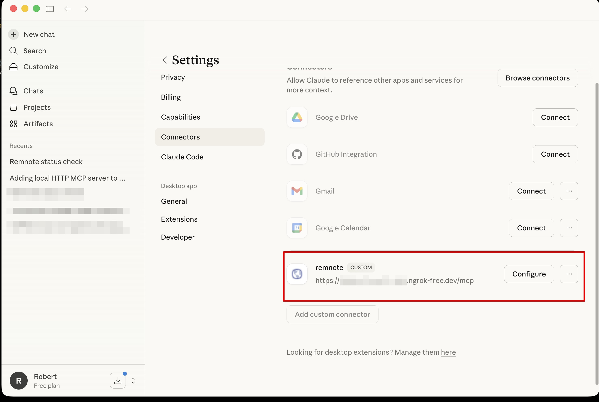
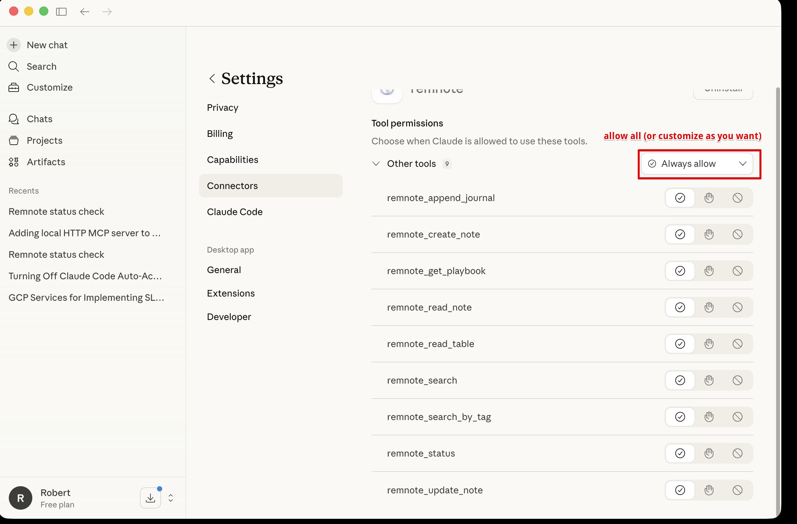
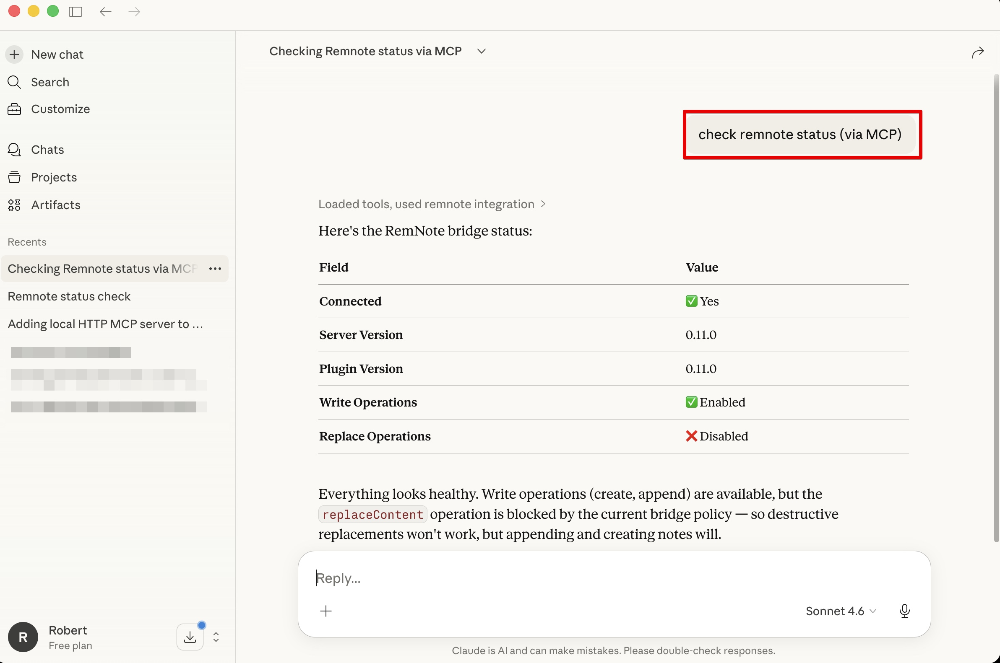

# Claude Desktop / Cowork Configuration

How to configure Claude Desktop and Claude Cowork to connect to the RemNote MCP Server through Anthropic's remote
connector flow.

## Overview

Claude Desktop and Claude Cowork use Anthropic's remote connector infrastructure for custom MCP servers.

That means:

- The MCP server URL must be reachable from Anthropic over public HTTPS
- `http://localhost` will not work for this remote connector flow
- The same remote connector can be used from Claude Desktop and Claude Cowork

This guide covers the remote HTTPS connector path. Anthropic also has separate local MCP / desktop extension flows,
but those are not covered here.

## Prerequisites

- RemNote MCP Server installed and running locally
- RemNote app running with RemNote Automation Bridge plugin installed and connected
- Remote HTTPS access to your local MCP endpoint (see [Remote Access Setup](remote-access.md))
- Public MCP URL ending with `/mcp` (for example, `https://abc123.ngrok-free.app/mcp`)

## Configure Claude Desktop

1. Complete remote access setup and copy your public HTTPS MCP URL.
2. Open Claude Desktop and go to your account menu, then **Settings -> Connectors**.
3. Click **Add custom connector**.



4. Create a connector such as `remnote` and set the server URL to your public MCP endpoint:

```text
https://abc123.ngrok-free.app/mcp
```



5. Open **Configure** for the connector and review tool permissions. `Always allow` is the simplest option if you
   trust your local setup; otherwise customize permissions tool-by-tool.



6. Start a new chat and run a quick check:

```text
check remnote status (via MCP)
```

You can also ask Claude more explicitly:

```text
Use remnote_status to check the connection
```

Expected: the response includes bridge connection information, server version, and plugin version.



## Configure Claude Cowork

Claude Cowork uses the same remote connector model and the same public HTTPS endpoint.

1. Complete remote access setup and copy your public HTTPS MCP URL.
2. In Claude Cowork, add or reuse the RemNote custom connector with the same URL:

```text
https://abc123.ngrok-free.app/mcp
```

3. Run the same quick check:

```text
check remnote status (via MCP)
```

Expected: the response includes connection information and plugin details.

## Example Usage

Once configured, Claude Desktop and Claude Cowork can use RemNote tools:

**Search:**
```text
Search my RemNote for notes about "blue light & sleep"
```

**Create notes:**
```text
Create a RemNote note with key findings from this conversation
```

**Update notes:**
```text
Add today's discussion to my RemNote journal
```

See the [Tools Reference](tools-reference.md) for detailed documentation of all available tools.

## Related Documentation

- [Remote Access Setup](remote-access.md) - Tunnel setup, security, and troubleshooting
- [Tools Reference](tools-reference.md) - Available MCP tools and usage
- [Troubleshooting](troubleshooting.md) - Common issues and solutions

## Need Help?

- [Remote Access Setup](remote-access.md) - Tunnel setup and diagnostics
- [Troubleshooting Guide](troubleshooting.md) - Common issues and solutions
- [GitHub Issues](https://github.com/robert7/remnote-mcp-server/issues) - Report problems or ask questions
